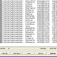

<Hero slots="image, heading, text, buttons" variant="halfwidth" />

# Your audio workstation, turbo-powered.

Unlock the power of the Audition. Support custom file formats, convert to and from multitrack sessions, and integrate custom control surfaces. Automate complex tasks, connect to web services, and add panels that seamlessly fit into the editing workspace.

- [Get the SDKs](https://console.adobe.io/downloads/au)

<TextBlock slots="heading, text" width="33%" theme="light" isCentered />

### Automate complex workflows

Build panels that streamline how media is managed. Simplify the search and ingest of source media, and automate tedious and error-prone steps for final delivery.

<TextBlock slots="heading, text" width="33%" theme="light" isCentered />

### Integrate control surface hardware

Use the two-way communication capabilities of the control surface API to sync Audition with hardware faders, VU meters, color grading controls, and more.

<TextBlock slots="heading, text" width="33%" theme="light" isCentered />

### Add support for new file formats

Build plug-ins to support the import and export of custom file formats, and convert to and from native Audition multitrack sessions.

<TextBlock slots="image, heading, text" width="33%" theme="light" isCentered />

### Integrate external control hardware

Use the two-way communication capabilities of the control surface plug-in API to sync Premiere Pro with hardware faders, VU meters, color grading controls, and more.

<TextBlock slots="image, heading, text" width="33%" theme="light" isCentered />

### Add support for new file formats

Support the import and export of custom file formats, or extended metadata.

<TextBlock slots="image, heading, text" width="33%" theme="light" isCentered />

### Multitrack session import/export

Create or convert to and from native Audition multitrack sessions.

<TextBlock slots="image, heading, text" width="33%" theme="light" isCentered />

### Integrate web services

Host your web service interface in a dedicated panel, with full drag-and-drop, metadata transfer, and file analysis support using standard web frameworks or Node.js.

<TextBlock slots="image, heading, text" width="33%" theme="light" isCentered />

#### Manipulate metadata

Get and set all metadata associated with project items, including all supported marker types and Audition private project metadata.

<TextBlock slots="image, heading, text" width="33%" theme="light" isCentered />

#### Preview and control

Preview supported footage and programmatically control playback or other events, even without bringing the footage into the current session.

<TextBlock slots="image, heading, text, links" width="33%" theme="light" isCentered />

### SESBackup

Easily and quickly locate and backup your Adobe Audition session files.

- [Learn more](https://creative.adobe.com/addons/products/2953#.WTc_98m1tTY)

<TextBlock slots="image, heading, text, links" width="33%" theme="light" isCentered />

### MediaSweeper

Identify and manage unused files from your Audition sessions (ses, xml, and sesx).

- [Learn more](https://creative.adobe.com/addons/products/3147#.WTdAqcm1tTY)

<TextBlock slots="image, heading, text, links" width="33%" theme="light" isCentered />

### Punch and Roll

Perform non-destructive punch-ins in multitrack sessions, with adjustable crossover blends and preroll times, 're-punch', and more.

- [Learn more](https://exchange.adobe.com/addons/products/19853#.Wi4XyRNSy3U)

<SummaryBlock slots="image, heading, text, buttons" background="rgb(246, 16, 27)" />

## Get the latest news for Creative Cloud Developers

With the Creative Cloud Developer Newsletter and the Adobe Tech Blog, we offer regular content for anyone who creates plugins and integrations for the Creative Cloud family of products and services. Get updates in your inbox, in your RSS reader, or both!

- [Join the newsletter](http://adobe.ly/devnews)
- [Follow the blog](https://medium.com/adobetech)
