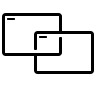

<Hero slots="image, heading, text, buttons" variant="halfwidth" />

# Leverage your skills to enhance and extend Dreamweaver

Dreamweaver provides its own API as well as Common Extensibility Platform (CEP), and offers you the flexibility of using C++, HTML, CSS, and JS to build extensions for Dreamweaver. You can extend the Dreamweaver UI, add powerful features for building web apps and automate entire cross-application workflows.

- [Start building today](https://helpx.adobe.com/dreamweaver/apiref/topics.html)

<TextBlock slots="heading, text" width="33%" theme="light" isCentered />

### Build custom web development tools

Your Dreamweaver extensions can import database data into web forms, auto-generate web layouts from designs, provide easy construction of web UI components, create custom color palettes, and much more. Your only limit is your imagination.

<TextBlock slots="heading, text" width="33%" theme="light" isCentered />

### Drive web development through automation

Both the Dreamweaver API and CEP give you the power to develop automatic processes and workflows that function not only within Dreamweaver, but across Adobe CC apps.

<TextBlock slots="heading, text" width="33%" theme="light" isCentered />

### Build on a familiar foundation

Use CEP and the web development skills you already have to create your own HTML-based panels that provide the specific functionality you want.

<TextBlock slots="image, heading, text" width="33%" theme="light" isCentered />

### Extend Dreamweaver using C++ and JavaScript

Write extensions built in C++ or JavaScript that use the API to add your own functionality to Dreamweaver. Scripts written in JavaScript can work with C++ extensions or stand on their own.

<TextBlock slots="image, heading, text" width="33%" theme="light" isCentered />

### Leverage the Common Extensbility Platform (CEP)

Dreamweaver now supports CEP, which lets you build plug-ins and panels for Dreamweaver using HTML, CSS and JavaScript—no C++ required! Use CEP across Creative Cloud apps to integrate Dreamweaver into cross-app workflows.

<TextBlock slots="image, heading, text" width="33%" theme="light" isCentered />

### Add server-side functions to your extensions

The Dreamweaver API lets you access server-side data, load server-side scripts, and even support new web server models in your extensions.

<TextBlock slots="image, heading, text" width="33%" theme="light" isCentered />

### Add your own menus, panels, toolbars, reports, and inspectors

Your extensions can modify the Dreamweaver UI in almost any way you want. Add new items to menus and toolbars or entirely new ones; create your own floating panels, reports, and property inspectors.

<TextBlock slots="image, heading, text" width="33%" theme="light" isCentered />

#### Share your extensions

Package your extensions and upload them to the Adobe Exchange marketplace to monetize your work; or distribute them independently as you wish.

<SummaryBlock slots="image, heading, text, buttons" background="rgb(246, 16, 27)" />

## Get the latest news for Creative Cloud Developers

With the Creative Cloud Developer Newsletter and the Adobe Tech Blog, we offer regular content for anyone who creates plugins and integrations for the Creative Cloud family of products and services. Get updates in your inbox, in your RSS reader, or both!

- [Join the newsletter](http://adobe.ly/devnews)
- [Follow the blog](https://medium.com/adobetech)
