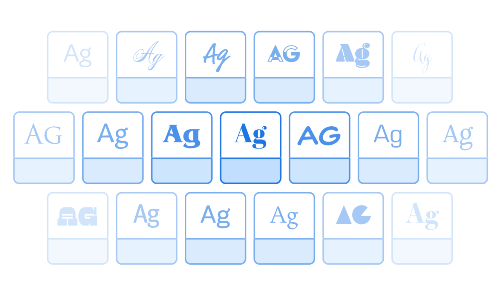
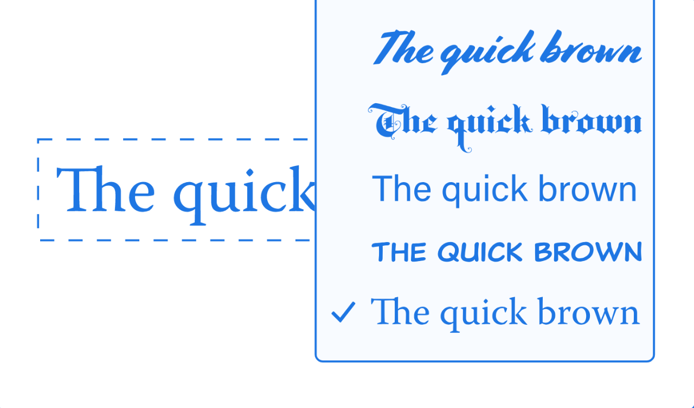

<Hero slots="image, heading, text, buttons" variant="halfwidth" />

# Integrate Unlimited Fonts

Build the Adobe Fonts Library into your application experience with our platform.    Please note we are not currently accepting new integrations while we plan updates to our documentation. Existing third-party integrations can reference existing [documentation](https://www.adobe.io/apis/creativecloud/adobe-fonts/docs.html) or [email us](mailto:fontintegrations@adobe.com) with questions.

- [Read the Docs](https://www.adobe.io/apis/creativecloud/adobe-fonts/docs.html)
- [Email Us](mailto:fontintegrations@adobe.com)

<TextBlock slots="image, heading, text" width="33%" theme="light" isCentered />

### Browse Fonts

Yup, there’s a lot of ’em. Maybe you’d like to give your customers the option to browse our library, or even a custom selection of fonts. Build the font menu of your dreams with our APIs.

<TextBlock slots="image, heading, text" width="33%" theme="light" isCentered />

### Publish Kits

Publish great type on the web, by building a kit of specified fonts that will load on specific domains using a simple HTML embed code. With our APIs, you can choose fonts and create kits from within your own application.

<TextBlock slots="image, heading, text" width="33%" theme="light" isCentered />

### Resolve Missing Fonts

You’ve got a file open, but not all the embedded fonts are there. Now what? Use our API to find missing fonts. We’ll match what we can with fonts from the Adobe Fonts library.

<SummaryBlock slots="image, heading, text, buttons" background="rgb(246, 16, 27)" />

## Get the latest news for Creative Cloud Developers

With the Creative Cloud Developer Newsletter and the Adobe Tech Blog, we offer regular content for anyone who creates plugins and integrations for the Creative Cloud family of products and services. Get updates in your inbox, in your RSS reader, or both!

- [Join the newsletter](http://adobe.ly/devnews)
- [Follow the blog](https://medium.com/adobetech)
