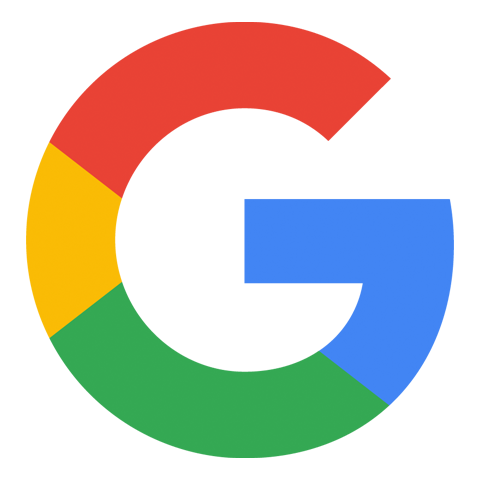

---
keywords:
  - Creative Cloud
  - API Documentation
  - JavaScript
  - CC Libraries API
  - Creative Cloud Libraries API
title: Creative Cloud Libraries API
description: Connect your app to Creative Cloud Libraries. Give users access to all their stored creative elements, like logos, colors, and more.
---

<Hero slots="image, heading, text, buttons" variant="halfwidth" />

# Accelerate Creativity with the Creative Cloud Libraries API

_Please note we are not currently accepting new integrations._ Existing third-party integrations can reference the [existing documentation](../creative-cloud-libraries/docs/) or <a href="mailto:ccintrev@adobe.com">email us</a> with questions.  Connect your application to Creative Cloud Libraries and expand the reach of your user’s creative system. Let users save and access design elements including colors, character styles, logos, and images within your application or within Creative Cloud mobile and desktop apps.

- [Learn more about Libraries](../creative-cloud-libraries/docs/overview/product-overview/)
- [Go to the documentation](../creative-cloud-libraries/docs/)

<TitleBlock slots="heading, text" theme="dark" />

# Please Note:

We are not currently accepting new integrations. Existing third-party integrations can reference the [existing documentation](../creative-cloud-libraries/docs/).  

<TitleBlock slots="heading" theme="light" />

### See the Libraries API in action

<!-- <TextBlock slots="image, heading, text, links" width="33%" theme="light" isCentered />

### Libraries in CameraIQ

CameraIQ is using Creative Cloud Libraries to help creatives and marketers build augmented reality experiences.

- [Learn more](https://cameraiq.com/) -->

<TextBlock slots="image, heading, text, links" width="50%" theme="light" isCentered />

### Libraries in Mural

Mural tapped into Creative Cloud Libraries to make sure their customers could easily share their most important assets for visual collaboration.

- [Learn more](https://www.mural.co/)

<TextBlock slots="image, heading, text, links" width="50%" theme="light" isCentered />

### Libraries in Google

In Google Workspace, users can access colors, graphics, and character styles from Creative Cloud Libraries for on brand documents and presentations.

- [Learn more](https://gsuite.google.com/marketplace/app/adobe_creative_cloud/969673929375)

<SummaryBlock slots="image, heading, text, buttons" background="rgb(9, 90, 186)" />

## Get the latest news for Creative Cloud Developers

With the Creative Cloud Developer Newsletter and the Adobe Tech Blog, we offer regular content for anyone who creates plugins and integrations for the Creative Cloud family of products and services. Get updates in your inbox, in your RSS reader, or both!

- [Join the newsletter](http://adobe.ly/devnews)
- [Follow the blog](https://medium.com/adobetech)
