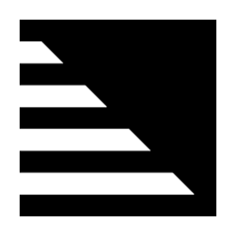
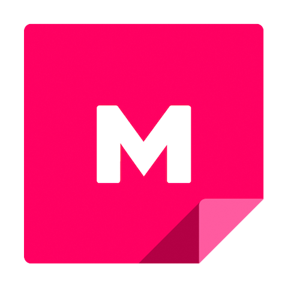
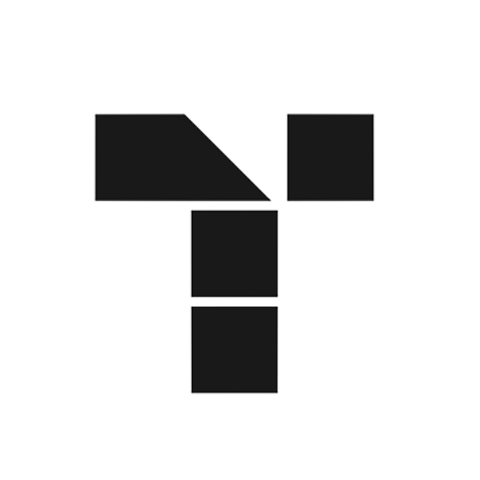
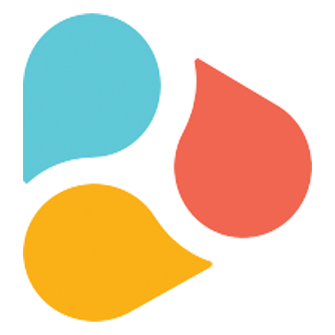

<Hero slots="image, heading, text, buttons" variant="halfwidth" />

# Accelerate Creativity with the Creative Cloud Libraries API

Connect your application to Creative Cloud Libraries and expand the reach of your user’s creative system. Let users save and access design elements including colors, character styles, logos, and images within your application or within Creative Cloud mobile and desktop apps. 

- [Go to the Documentation](../creative-cloud-libraries/docs/)
- [Learn more about Libraries](../creative-cloud-libraries/docs/overview/product-overview/)

<TitleBlock slots="heading, text" theme="dark" />

# Get Started Integrating with Creative Cloud Libraries

Check out the documentation and quickly start bringing the power of the Creative Cloud into your application.

<TextBlock slots="heading, text, buttons" width="33%" theme="dark" isCentered />

### Quick Starts

Make your first API call in curl or Node.js.

- [Get Started](../creative-cloud-libraries/docs/integrate/tutorials/)

<TextBlock slots="heading, text, buttons" width="33%" theme="dark" isCentered />

### API Docs

Get all the details in the API reference documentation.

- [Explore the API](../creative-cloud-libraries/docs/api/)

<TextBlock slots="heading, text, buttons" width="33%" theme="dark" isCentered />

### Discover Elements

Learn all the ways you can use Library elements

- [See the Docs](../creative-cloud-libraries/docs/integrate/guides/working-with-elements/)

<TitleBlock slots="heading" theme="light" />

### See the Libraries API in Action

<TextBlock slots="image, heading, text, links" width="20%" theme="light" isCentered />

### Libraries in CameraIQ

CameraIQ is using Creative Cloud Libraries to help creatives and marketers build augmented reality experiences.

- [Learn more]()

<TextBlock slots="image, heading, text, links" width="20%" theme="light" isCentered />

### Libraries in Mural

Mural tapped into Creative Cloud Libraries to make sure their customers could easily share their most important assets for visual collaboration.

- [Learn more]()

<TextBlock slots="image, heading, text, links" width="20%" theme="light" isCentered />

### Libraries in Tiled

Tiled connected Creative Cloud Libraries to help users create on brand, interactive experiences.

- [Learn more](https://tiled.co/cclibraries/)

<TextBlock slots="image, heading, text, links" width="20%" theme="light" isCentered />

### Libraries in Frontify

Frontify integrated with Creative Cloud Libraries to help users create brand consitency.

- [Learn more](https://tiled.co/cclibraries/)

<TextBlock slots="image, heading, text, links" width="20%" theme="light" isCentered />

### Libraries in Holabrief

Holabrief used Creative Cloud Libraries to make it easy for teams to make creative briefs.

- [Learn more](https://tiled.co/cclibraries/)

<SummaryBlock slots="image, heading, text, buttons" background="rgb(9, 90, 186)" />

## Get the latest news for Creative Cloud Developers

With the Creative Cloud Developer Newsletter and the Adobe Tech Blog, we offer regular content for anyone who creates plugins and integrations for the Creative Cloud family of products and services. Get updates in your inbox, in your RSS reader, or both!

- [Join the newsletter](http://adobe.ly/devnews)
- [Follow the blog](https://medium.com/adobetech)
