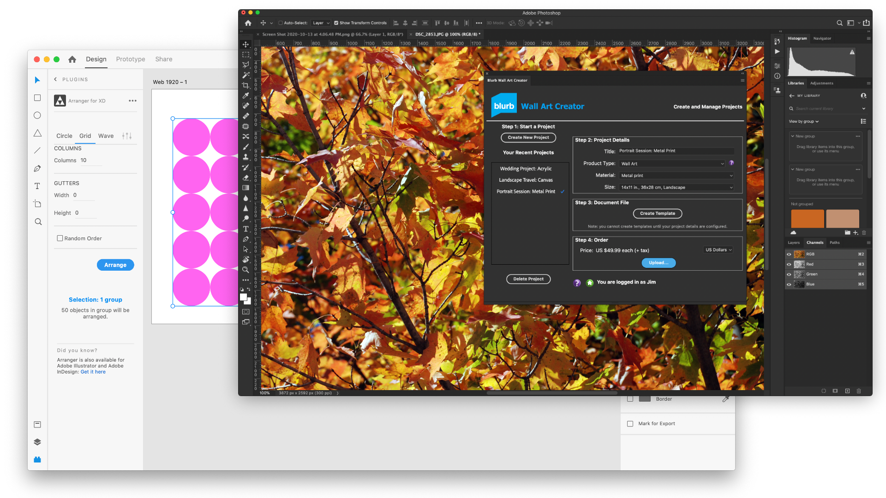
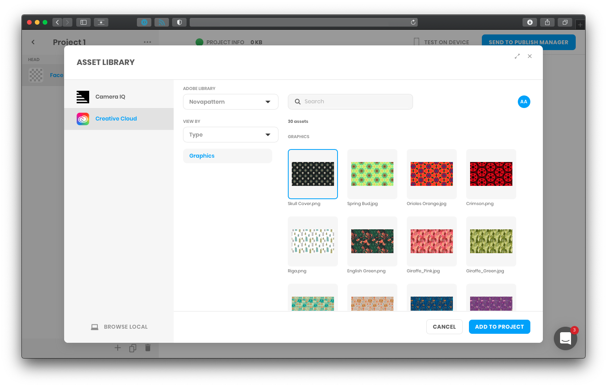
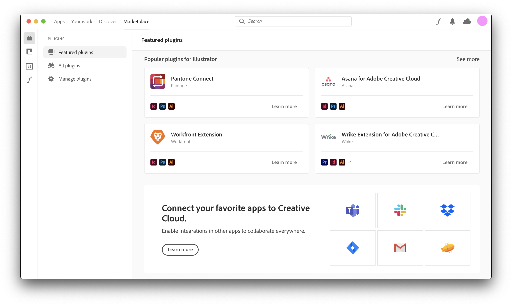
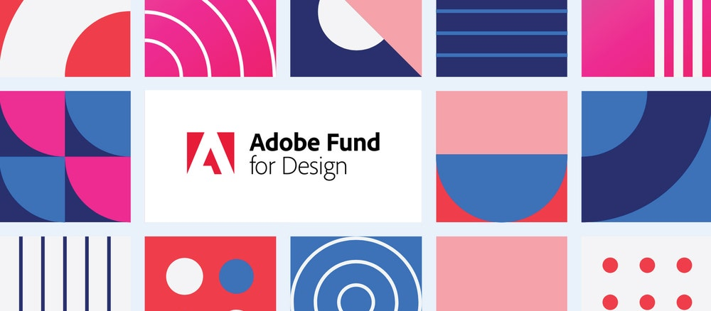

import CCProductCards from 'dev-site-product-index/src/transclusions/creative-cloud.md'

<Hero slots="image, heading, icon, text" variant="halfwidth" />

# Develop with Adobe Creative Cloud

Adobe Creative Cloud APIs and SDKs enable developers to impact creative work for millions of users worldwide. Build and distribute inspiring, productivity-driving plugins and integrations—all with Adobe Creative Cloud.

<AnnouncementBlock slots="heading, text, button" />

### Join the Creative Cloud Developer Newsletter

Be the first to hear about API launches, technology updates, marketplace news, developer events, and more by joining the Creative Cloud Developer Newsletter.

[Sign up today](http://adobe.ly/devnews)

<TextBlock slots="image, heading, text1, links" />

## Extend Adobe Creative Cloud apps

Creative Cloud desktop apps offer APIs and SDKs that let you build connected workflows and enhance creative output. Write plugins and scripts that are easy to discover, install, and update. Give teams and individuals the power to tailor industry-leading creative apps to their unique creative needs and collaborative processes. [Browse the full list.](#api-list)

-  [Photoshop](photoshop)
-  [Adobe XD](xd)
-  [InDesign](https://www.adobe.io/apis/creativecloud/indesign.html)

<TextBlock slots="heading, text1, links, image" />

## Integrate Creative Cloud services into your apps

With Creative Cloud service APIs, developers can create integrations that enable users to access their content and tools everywhere they work. Bring powerful collaborative features and rich creative assets from Adobe right into your own apps and services by integrating with Creative Cloud. [Browse the full list.](#api-list)

- [Creative Cloud Libraries](libraries)
- [Adobe Stock](https://www.adobe.io/apis/creativecloud/stock.html)
- [Adobe Fonts](fonts)

<TextBlock slots="image, heading, text1, links" />

## Distribute to millions of creative users worldwide

Publish plugins and integrations for teams and individuals to discover and install on the Creative Cloud Plugin Marketplace and the Enterprise Admin Console. Get your work in front of creatives everywhere by distributing with Creative Cloud.

- [Creative Cloud Plugin Marketplace](https://exchange.adobe.com/creativecloud.html?route=discoverIntegrations&workflow=share)

<TitleBlock slots="heading, text" theme="light" />

# The Adobe Fund for Design

Since 2018, the Adobe Fund for Design has provided equity investments and grants to people and companies who want to push boundaries and help shape the future of design and creativity. Fund recipients also receive expert advice, early access to products and technology, go-to-market support, and more.

<ResourceCard slots="link, image, heading, text" width="50%" variant="vertical" />

[Adobe Fund for Design](https://www.adobe.com/products/xd/adobe-fund.html)

### Adobe Fund for Design: Investing in developers with creativity in their code

Apply for equity investments and grants from Adobe for your project.

<ResourceCard slots="link, image, heading, text" width="50%" />

[Supporting Creative Cloud Developers with the Adobe Fund for Design](https://blog.adobe.com/en/publish/2020/06/15/adobe-fund-for-design-creative-cloud-developers.html#gs.iaz41v)

### Supporting Creative Cloud Developers with the Adobe Fund for Design

Commissioned projects, and our commitment to developers from underrepresented communities.

<ResourceCard slots="link, image, heading, text" width="50%" />

[One Year of the Adobe Fund for Design: Supporting, Uplifting and Empowering Innovators in the Creative Community](https://blog.adobe.com/en/publish/2019/09/10/fund-for-design-new-design-tools.html#gs.iaz41y)

### One Year of the Adobe Fund for Design

Supporting, Uplifting and Empowering Innovators in the Creative Community

<!-- Product cards -->

<TitleBlock slots="heading, text" theme="light" />

# Extensible Creative Cloud products and services

Many creative cloud apps and services are extensible through in-app APIs and SDKs, or service APIs and events. Choose your favorite to learn more.

<CCProductCards />

<!-- Summary block -->

<SummaryBlock slots="image, heading, text, buttons" background="rgb(246, 16, 27)" />

## Get the latest news for Creative Cloud Developers

With the Creative Cloud Developer Newsletter and the Adobe Tech Blog, we offer regular content for anyone who creates plugins and integrations for the Creative Cloud family of products and services. Get updates in your inbox, in your RSS reader, or both!

- [Join the newsletter](http://adobe.ly/devnews)
- [Follow the blog](https://medium.com/adobetech)
