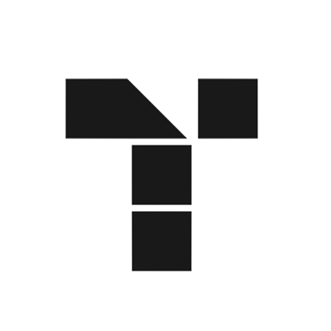
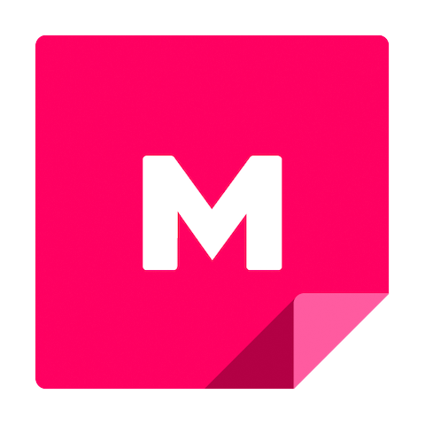

<Hero slots="image, heading, text, buttons" variant="halfwidth" />

# Accelerate Creativity with the Creative Cloud Libraries API

Creative Cloud Libraries are the foundation of your users' creative system, enabling element re-use across teams and documents. They manage, organize, and keep elements of your user’s creative system like colors, character styles, logos, and images for use in Creative Cloud apps and connected experiences.     With the Creative Cloud Libraries API you can connect your application to Libraries and expand the reach of your user’s creative system. This helps them work more efficiently by providing access to those creative elements inside your application and connecting your application back to the Creative Cloud products.

- [Get started](https://adobe.io)
- [Sign up for the newsletter](https://adobe.io)

<TextBlock slots="image, heading, text, links" width="33%" theme="light" isCentered />

### Libraries in CameraIQ

CameraIQ is using Creative Cloud Libraries to help creatives and marketers build augmented reality experiences.

- [Learn more](https://www.microsoft.com/microsoft-365/microsoft-teams/group-chat-software)

<TextBlock slots="image, heading, text, links" width="33%" theme="light" isCentered />

### Libraries in Tiled

Tiled connected Creative Cloud Libraries to help users create on brand, interactive experiences.

- [Learn more](https://tiled.co/cclibraries/)

<TextBlock slots="image, heading, text, links" width="33%" theme="light" isCentered />

### Libraries in Mural

Mural tapped into Creative Cloud Libraries to make sure their customers could easily share their most important assets for visual collaboration.

- [Learn more](https://slack.com/enterprise)

<SummaryBlock slots="image, heading, text, buttons" background="rgb(246, 16, 27)" />

## Get the latest news for Creative Cloud Developers

With the Creative Cloud Developer Newsletter and the Adobe Tech Blog, we offer regular content for anyone who creates plugins and integrations for the Creative Cloud family of products and services. Get updates in your inbox, in your RSS reader, or both!

- [Join the newsletter](http://adobe.ly/devnews)
- [Follow the blog](https://medium.com/adobetech)
