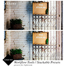

<Hero slots="image, heading, text, buttons" variant="halfwidth" />

# Digital photo management, unleashed. – Built for speed, easy to share

The Adobe Lightroom software development kit (SDK) gives you a clean, fast, lightweight toolset for enhancing and extending the capabilities of the leading image management and sharing software. Plug-ins you build in Lua, the scripting language built into Lightroom, and the Lightroom SDK let you create effects, define image processing presets and brushes, add items to Lightroom menus and dialogs, manipulate metadata, and create new types of web galleries for your images.   The guides, documentation, and sample code in the SDK shows you how to leverage Lua to access the Lightroom API, opening the power of the app to your control. Your plug-ins can be given away or sold in the [Adobe Exchange](https://exchange.adobe.com/addons) marketplace where users can browse and install extensions. Download the SDK today and discover the power to enhance and extend Lightroom as you see fit.

- [Start building today](https://console.adobe.io/downloads/lr)

<TextBlock slots="heading, text" width="33%" theme="light" isCentered />

### A light, clean,   simple coding environment

With Lua, the scripting language, and the Lightroom SDK, you can quickly develop plug-ins in your favorite editing tools or even a simple text editor.

<TextBlock slots="heading, text" width="33%" theme="light" isCentered />

### Exercise absolute image control

Build Develop presets, custom export settings, metadata management, and more—on individual images and entire image libraries.

<TextBlock slots="heading, text" width="33%" theme="light" isCentered />

### Connect to 3rd party websites

Connect Lightroom with 3rd party websites for easy and quick sharing.

<TextBlock slots="image, heading, text" width="33%" theme="light" isCentered />

### Leverage the power of Lua

Write extensions built in C++ or JavaScript that use the API to add your own functionality to Dreamweaver. Scripts written in JavaScript can work with C++ extensions or stand on their own.

<TextBlock slots="image, heading, text" width="33%" theme="light" isCentered />

### Customize export and publish

Dreamweaver now supports CEP, which lets you build plug-ins and panels for Dreamweaver using HTML, CSS and JavaScript—no C++ required! Use CEP across Creative Cloud apps to integrate Dreamweaver into cross-app workflows.

<TextBlock slots="image, heading, text" width="33%" theme="light" isCentered />

### Work with metadata

The Dreamweaver API lets you access server-side data, load server-side scripts, and even support new web server models in your extensions.

<TextBlock slots="image, heading, text" width="33%" theme="light" isCentered />

### AEnhance the Lightroom UI

Your extensions can modify the Dreamweaver UI in almost any way you want. Add new items to menus and toolbars or entirely new ones; create your own floating panels, reports, and property inspectors.

<TextBlock slots="image, heading, text" width="33%" theme="light" isCentered />

### Build web engine plug-ins

Package your extensions and upload them to the Adobe Exchange marketplace to monetize your work; or distribute them independently as you wish.

<TextBlock slots="image, heading, text" width="33%" theme="light" isCentered />

### Build web engine plug-ins

Package your extensions and upload them to the Adobe Exchange marketplace to monetize your work; or distribute them independently as you wish.

<InlineAlert variant="help" slots="text"/>

I don't know why these aren't aligning.

<TextBlock slots="image, heading, text, links" width="33%" theme="light" isCentered />

### +PS Workflow Tools

A collection of 130 presets to shorten time during editing.

- [Learn more](https://creative.adobe.com/addons/products/2672#.WTdCcMm1tTY)

<TextBlock slots="image, heading, text, links" width="33%" theme="light" isCentered />

### Evlaa

Publishing proofs online directly from Lightroom and get client feedback.

- [Learn more](https://creative.adobe.com/addons/products/15323#.WTdCgMm1tTY)

<TextBlock slots="image, heading, text, links" width="33%" theme="light" isCentered />

### WP/LR Syn

Publish photos to WordPress and keep them in sync.

- [Learn more](https://creative.adobe.com/addons/products/4932#.WTdCesm1tTY)

<SummaryBlock slots="image, heading, text, buttons" background="rgb(246, 16, 27)" />

## Get the latest news for Creative Cloud Developers

With the Creative Cloud Developer Newsletter and the Adobe Tech Blog, we offer regular content for anyone who creates plugins and integrations for the Creative Cloud family of products and services. Get updates in your inbox, in your RSS reader, or both!

- [Join the newsletter](http://adobe.ly/devnews)
- [Follow the blog](https://medium.com/adobetech)
