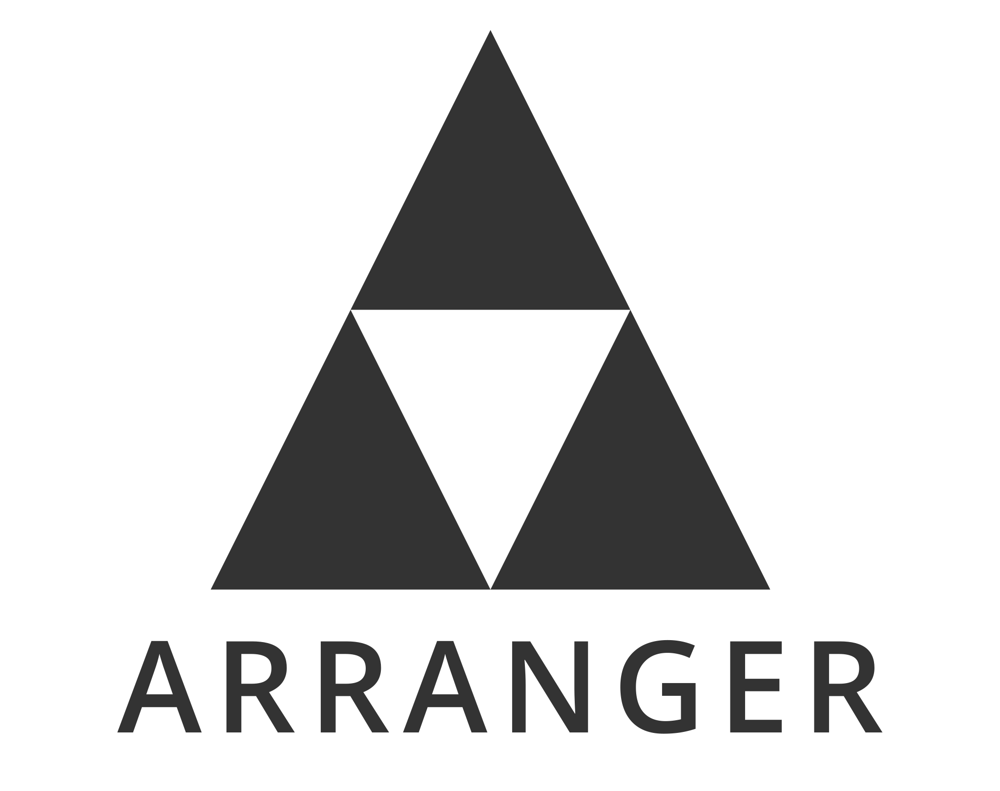

<Hero slots="image, heading, icon, text" variant="halfwidth" />

# Photoshop is extensible like never before

The creative world runs on Photoshop—and with Photoshop APIs and SDKs, developers can take it even further. Build plugins and integrations that harness the power of the world’s best image editing and graphic design software to transform creative workflows for users everywhere.

<TitleBlock slots="heading, text" theme="dark" />

# APIs for any use case

Whether you want to build in-app plugins or compute-intense low-level tools; or if you want to integrate the power of Photoshop into your own app or service, there's something here for everyone.

<TextBlock slots="heading, text, buttons" width="25%" theme="dark" isCentered />

### UXP Plugin API

Build performant plugins with modern HTML, CSS, and JavaScript. UXP is the next generation of plugin APIs, for Photoshop 22 and beyond.

- [View the docs](photoshop/uxp/)

<TextBlock slots="heading, text, buttons" width="25%" theme="dark" isCentered />

### Photoshop API

Use Photoshop, Lightroom, and Sensei together to create web or server-based workflows to cut out images, reflow banner ads, and more.

- [Learn more](https://www.adobe.io/apis/creativecloud/photo-imaging-api.html)

<TextBlock slots="heading, text, buttons" width="25%" theme="dark" isCentered />

### CEP and ExtendScript

Build classic extensions and scripts with CEP and ExtendScript.

- [Visit the repo](https://github.com/Adobe-CEP/CEP-Resources/blob/master/CEP_10.x/Documentation/CEP%2010.0%20HTML%20Extension%20Cookbook.md)

<TextBlock slots="heading, text, buttons" width="25%" theme="dark" isCentered />

### C++ SDK

Build powerful, low-level integrations using the C++ SDK.

- [Download the SDK](https://console.adobe.io/downloads)

<TitleBlock slots="heading, text" theme="light" />

### Check out our new UXP Plugins

Check out the newest generation of plugins build using the UXP API.

<TextBlock slots="image, heading, text, links" width="33%" theme="light" isCentered />

### Pixel Squid

Use PixelSquid to easily add 3D objects to your design and spin to select your perfect angle in Photoshop.

* [Check it out](https://www.pixelsquid.com/plugin_demo)

<TextBlock slots="image, heading, text, links" width="33%" theme="light" isCentered />

### Arranger

Arrange art objects as a circle, grid, wave, or honeycomb in XD, InDesign, Illustrator, and now in Photohsop.

* [Download it](https://omata.io/arranger)
* [Read more](https://medium.com/adobetech/a-case-study-on-arranger-making-the-leap-from-cep-to-uxp-c64227b6ea74?source=friends_link&sk=8612cd25ce4b8721d489cb632e0338d5)

<TextBlock slots="image, heading, text, links" width="33%" theme="light" isCentered />

### Trello

Easily send assets to your Trello board, withut ever leaving Photoshop.

* [Learn more](https://trello.com/integrations)

<TextBlock slots="video, heading, text, buttons" width="50%" theme="dark" />

[Banner Ad Reflow](https://www.youtube.com/watch?v=vOvyOM6ka98&feature=youtu.be&ab_channel=AdobePhotoshop)

### Photoshop Service API Demo

Our Banner Ad Reflow Extension allows you to create multiple banner ads from one design.

* [See a demo](https://www.adobe.io/apis/creativecloud/photo-imaging-api/api-demo.html?ref=bannerreflow)
* [Sign up to learn more](https://photoshop.adobelanding.com/api-signup/)

<SummaryBlock slots="image, heading, text, buttons" background="rgb(246, 16, 27)" />

## Get the latest news for Creative Cloud Developers

With the Creative Cloud Developer Newsletter and the Adobe Tech Blog, we offer regular content for anyone who creates plugins and integrations for the Creative Cloud family of products and services. Get updates in your inbox, in your RSS reader, or both!

- [Join the newsletter](http://adobe.ly/devnews)
- [Follow the blog](https://medium.com/adobetech)
