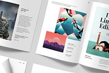

<Hero slots="image, heading, text, buttons" variant="halfwidth" />

# World-class assets. World-class creative community. – Build a better business with Adobe Stock.

Give your users access to stunning Adobe Stock high-quality images, graphics, and videos to use in their ads, email templates, and websites. It’s a great way to increase customer satisfaction and generate additional revenue—and it’s easy to implement.    Interested in partnering with Adobe Stock, or want to learn more about our plans and pricing options? Contact us, and please include [Adobe I/O] in the subject line.

- [Start building today](https://console.adobe.io/downloads/lr)

<TextBlock slots="image, heading, text" width="25%" theme="light" isCentered />

### Print on demand

Let users customize print projects with Adobe Stock assets to create brochures, business cards, posters, postcards, wall decals, and more.

<TextBlock slots="image, heading, text" width="25%" theme="light" isCentered />

### Marketing Platforms

Integrate Adobe Stock content into workflows for your websites and ad builders, and for your email, content marketing, and social media platforms.

<TextBlock slots="image, heading, text" width="25%" theme="light" isCentered />

### DAMs

Create a full end-to-end experience with Adobe Stock and your Digital Asset Management platform.

<TextBlock slots="image, heading, text" width="25%" theme="light" isCentered />

### Enterprise

Use the Adobe Stock API to make it easy for your team to find stock assets, access a shared license history, and enforce quotas between departments.

<!-- <TextBlock slots="image, heading, text" width="25%" theme="light" isCentered />

### Affiliates

Earn referral fees for including the search API or banners on your site. -->

<ResourceCard slots="link, image, heading, text" width="50%" />

[Adobe I/O](https://adobe.io)

### Microsoft

Search and license Adobe Stock images right inside Microsoft PowerPoint and Microsoft Teams, thanks to a strategic partnership between Adobe and Microsoft.

<ResourceCard slots="link, image, heading, text" width="50%" />

[Adobe I/O](https://adobe.io)

### Google

Add more polish to presentations with the Adobe Stock add-on for Google Slides. Find images by keywords or visual search and browse curated collections.

<ResourceCard slots="link, image, heading, text" width="50%" />

[Adobe I/O](https://adobe.io)

### Hootsuite

Get access to Adobe Stock inside Hootsuite, the most widely used social media management Platform, and publish content instantly to your channels.

<ResourceCard slots="link, image, heading, text" width="50%" />

[Adobe I/O](https://adobe.io)

### 99designs

The global creative platform gives designers on its platform the ability to easily and seamlessly access the Adobe Stock library of stock images. Learn more >

<ResourceCard slots="link, image, heading, text" width="50%" variant="vertical" />

[Adobe Tech Blog](https://medium.com/adobetech/adobe-stock-for-developers-913186f89415)

### Adobe Stock for Developers - Adobe Tech Blog - Medium

Adobe Stock's enterprise grade search API opens new doors to developers, companies, and their users.

<TextBlock slots="video, heading, text " />

[Adobe Stock Video](https://www.youtube.com/watch?v=uCcgozf0qVE&feature=youtu.be&ab_channel=AdobeDevelopers)

### Lorem ipsum dolor sit amet

Duis aute irure dolor in reprehenderit in voluptate velit esse cillum dolore eu fugiat nulla pariatur. Excepteur sint occaecat cupidatat non proident, sunt in culpa qui officia deserunt mollit anim id est laborum.

<SummaryBlock slots="image, heading, text, buttons" background="rgb(246, 16, 27)" />

## Get the latest news for Creative Cloud Developers

With the Creative Cloud Developer Newsletter and the Adobe Tech Blog, we offer regular content for anyone who creates plugins and integrations for the Creative Cloud family of products and services. Get updates in your inbox, in your RSS reader, or both!

- [Join the newsletter](http://adobe.ly/devnews)
- [Follow the blog](https://medium.com/adobetech)
